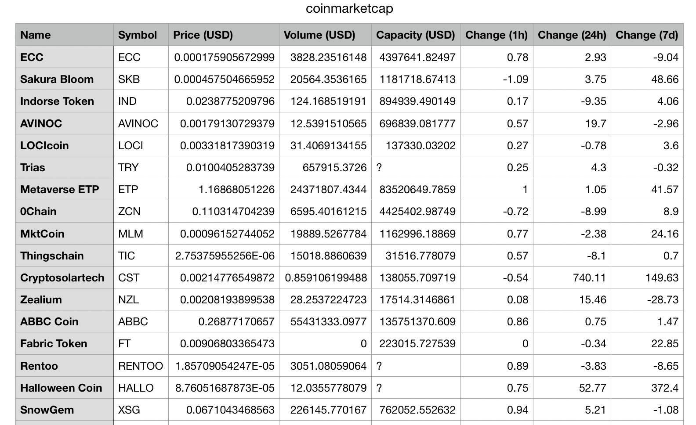

# crawli

A simple cralwer

<p align="center"></p>

## Getting started

```console
$ make build
$ ./bin/crawli
```

### Usage

```sh
Usage:
  crawli [flags]
  crawli [command]

Available Commands:
  collect     Collect data with given worksheet
  config      Create default config file
  help        Help about any command
  version     Print the version number of crawli

Flags:
  -h, --help   help for crawli
```

### Configuration

`crawli config` create `~/.crawli/config/config.toml` as a default configuration.

```
[database]
  host = "localhost"
  password = ""
  port = 5432
  user = "postgres"

[default]
  home = "$HOME/.crawli"

[workers]
  crontab = "0 3 * * *"
  max = 10
  min = 1
```

### Collect

```
./bin/crawli collect
open ~/.crawli/data/coinmarketcap.csv
```

<p align="center">

</p>


### TODO

- save collected data to persistent database like postgres, mysql
- daily cronjob task as daemon
